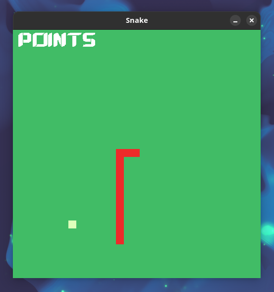

# CSnake
<center></center>

These are the first steps for creating our snake clone, we have organized the project files the cmake and created our window with green grass background. You need to install g++, CMAKE and SDL. With this line pasted on your terminal you have everything to start working!

### Ubuntu
```bash
sudo apt install g++ cmake libsdl2-dev libsdl2-ttf-dev
```
### Arch 
```bash
sudo pacman -S sdl2 sdl2_ttf 
```

### Build
```bash
mkdir build         # inside project folder
cd build 
cmake ..
```

### Compile and run 
```bash 
make                # inside the build folder
./Snake
```

### To-Do 
- Update Readme
- Comments 
- Bug Apple outside the screen